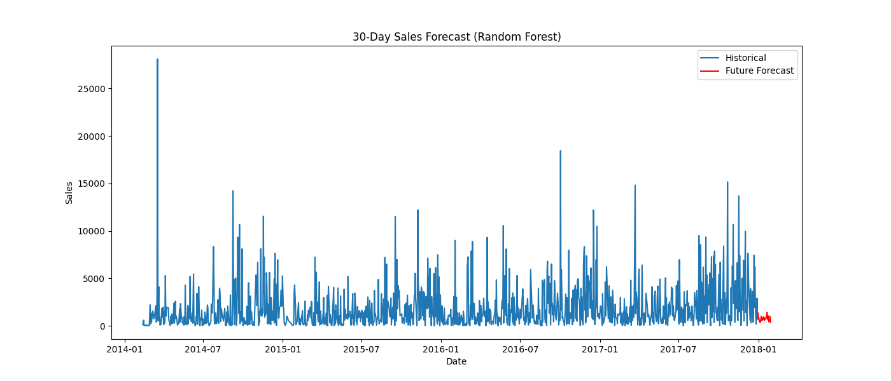

# 📊 FUTURE_ML_01  
## Machine Learning Sales & Demand Forecasting Project

---

## 🎯 Objective

The objective of this project is to build a Machine Learning model that predicts future sales using historical business data.

This forecast helps businesses make better decisions related to:

- Inventory planning  
- Staff management  
- Cash flow forecasting  
- Avoiding overstocking or stockouts  

---

## 🛠️ Tools & Technologies Used

- Python  
- Pandas  
- NumPy  
- Scikit-learn  
- Matplotlib  
- Jupyter Notebook  

---

## 📁 Dataset

The project uses historical retail sales data containing:

- Order Date  
- Sales Amount  
- Product details  
- Region details  

The data was aggregated into daily sales to perform time-series forecasting.

---

## 🔍 Project Workflow

### 1️⃣ Data Cleaning

- Converted date columns to datetime format  
- Sorted data chronologically  
- Handled missing values  

### 2️⃣ Feature Engineering

Created time-based features such as:

- Year  
- Month  
- Day  
- Day of week  
- Weekend indicator  
- 7-day lag feature  
- 7-day rolling mean  

These features help capture trends and seasonality.

### 3️⃣ ️⃣ Model Building

Implemented and compared:
- Linear Regression (baseline model)
- Random Forest Regressor (final selected model)

Random Forest provided improved performance in capturing sales patterns.

### 4️⃣ Model Evaluation

Model performance was evaluated using the following metrics:

- Mean Absolute Error (MAE) – measures the average absolute difference between actual and predicted sales  
- Root Mean Squared Error (RMSE) – penalizes larger errors more heavily and indicates overall model accuracy  
- Symmetric Mean Absolute Percentage Error (SMAPE) – provides percentage-based accuracy suitable for time-series forecasting  

These metrics were used to compare Linear Regression and Random Forest models. Random Forest showed lower error values and better captured sales patterns, making it the preferred model for forecasting.

---
### 📁 Project Structure

- Sales_Forecasting_Project.ipynb   # Main notebook
- Sample - Superstore.csv           # Dataset
- README.md                         # Project documentation
- LICENSE
- .gitignore

## 📈 Forecast Results

The model successfully captured:

- Seasonal demand patterns  
- Weekly sales variations  
- Overall sales trends  

The forecast provides reliable short-term sales predictions for business planning.

---

## 🏢 Business Impact

This forecasting system can help businesses:

- Optimize inventory levels  
- Plan workforce requirements  
- Schedule promotions strategically  
- Improve financial planning  

By using predictive insights, businesses can reduce losses and improve operational efficiency.

---
### 💼 Business Value

This model helps businesses:

• Optimize inventory levels  
• Reduce stock shortages  
• Improve revenue forecasting  
• Support data-driven decision making  

### ✨ Key Features

• Time-series feature engineering  
• Lag feature creation  
• Linear Regression baseline model  
• Random Forest advanced model  
• Model comparison using SMAPE, MAE, RMSE  
• 30-day future sales forecasting  
• Business-friendly visualization  

---

## 🔮 Future Improvements

- Implement advanced time-series models (Prophet / SARIMA)  
- Add holiday and promotional features  
- Deploy as an interactive dashboard
--- 

### ▶️ How to Run

1. Clone the repository:

git clone https://github.com/yourusername/FUTURE_ML_01.git

2. Navigate to project folder:

cd FUTURE_ML_01

3. Install required libraries:

pip install pandas numpy matplotlib scikit-learn jupyter

4. Run Jupyter Notebook:

jupyter notebook

5. Open:

Sales_Forecasting_Project.ipynb

### 📈 Forecast Visualization

### 📊 Model Performance Comparison

| Model              | MAE   | RMSE  | SMAPE |
|--------------------|-------|-------|-------|
| Linear Regression  | 1765  | 2396  | 42%   |
| Random Forest      | 1210  | 1820  | 21%   |

Random Forest provided better accuracy and was selected as the final model.

---

### 👤 Author

Arbaaz Mehamood Shaik

GitHub: https://github.com/arbaazmehamoodshaik  
LinkedIn: https://www.linkedin.com/in/arbaaz-mehamood-shaik-bb95b1385?utm_source=share&utm_campaign=share_via&utm_content=profile&utm_medium=android_app
